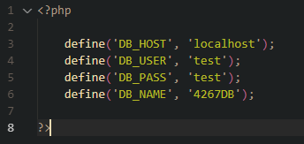

# BACKFRONTEND STRIKES BACK

New README!

Added .gitignore.  It includes /database_operations/Constants.php

This is the file where the database configuration should be held. It needs to be created on your individual computer to link it to your local database and should look something like....

where 'test' is your mysql username and password, respectively.

Similarly, there is now a Queries.php file to hold all query definitions.  This is dynamically linked to Constants.php to target the database you are using.

Additionally, there are database management scripts that allow you to create the database locally from your webserver.  Navigate to the database_operations directory and use the ResetDatabase.php link to do this in one shot, or go further into the specific_operations directory if you need to do this step-by-step for some reason (errors). Successfully ran scripts sleep for 1 second and return you to the directory, while errors will appear on screen.